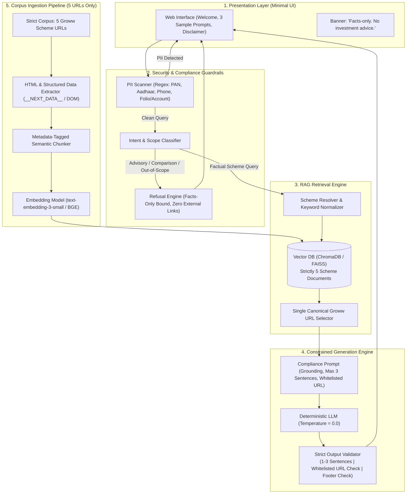
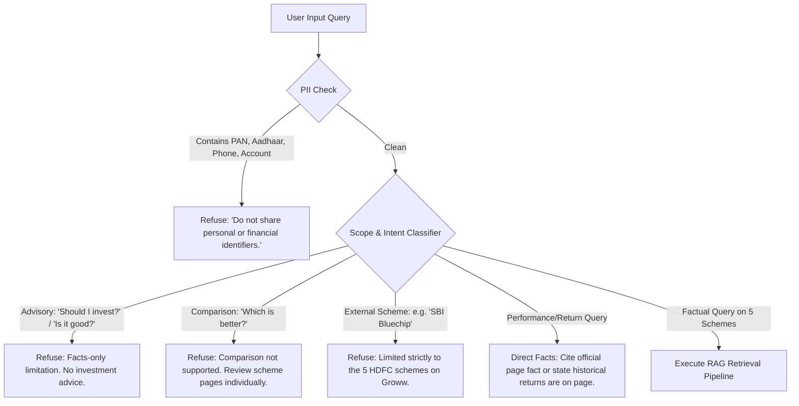

# Detailed Phase-Wise Architecture: Mutual Fund FAQ Assistant (Facts-Only RAG)

> **Iteration Constraint Notice**:
> For this iteration, the corpus is **strictly limited to the 5 designated Groww scheme pages**.
> - **No AMC PDFs** (KIM, SID, factsheets).
> - **No AMFI pages**.
> - **No SEBI pages**.
> - **No AMC FAQ pages**.
> - **No other Groww pages**.
> - **Every fact** returned must come strictly from one of these 5 URLs.
> - **Every citation** must be one of these 5 URLs — **verbatim**.

---

## 1. Executive Summary & System Philosophy
The **Mutual Fund FAQ Assistant** is a compliance-first, facts-only Retrieval-Augmented Generation (RAG) system operating strictly over 5 designated Groww mutual fund scheme pages.

### Core Invariants:
1. **Strictly Closed Corpus**: The system operates under a strict closed-world assumption over exactly 5 Groww product URLs. If a fact does not exist in the ingested text of these 5 pages, the system must state that the information is unavailable.
2. **Deterministic Attribution Contract**: Every generative response must strictly adhere to:
   - **Maximum 3 sentences**.
   - **Exactly 1 citation link**, which must match one of the 5 designated Groww URLs **verbatim**.
   - **Footer format**: `Last updated from sources: <date>`
3. **Zero Advisory Footprint**: Absolute prohibition against investment advice, comparisons, return calculations, or subjective guidance.
4. **No External Citations**: No links to AMC PDFs, AMFI, SEBI, or secondary web pages.
5. **Zero PII Exposure**: Absolute privacy barrier preventing collection, processing, or logging of user identifiers (PAN, Aadhaar, folio/account numbers, phone numbers).

---

## 2. End-to-End System Architecture



---

## 3. Phase-Wise Implementation Roadmap


---

### Phase 1: Corpus Definition & Strict Whitelist Lock

#### 1.1 Scope Definition
The corpus is strictly fixed to **5 Groww scheme URLs**. No additional sources, PDFs, or external sites may be added, ingested, or cited.

#### 1.2 Whitelisted URLs & Scheme Registry
The assistant is restricted to the following 5 canonical URLs:

| Index | Category | Scheme Name | Canonical Source URL (Verbatim Citation) |
| :--- | :--- | :--- | :--- |
| 1 | **Mid Cap** | HDFC Mid-Cap Opportunities Fund (Direct Growth) | `https://groww.in/mutual-funds/hdfc-mid-cap-fund-direct-growth` |
| 2 | **Flexi Cap** | HDFC Flexi Cap Fund (Direct Growth) | `https://groww.in/mutual-funds/hdfc-equity-fund-direct-growth` |
| 3 | **Focused Equity** | HDFC Focused 30 Fund (Direct Growth) | `https://groww.in/mutual-funds/hdfc-focused-fund-direct-growth` |
| 4 | **ELSS (Tax Saver)** | HDFC ELSS Tax Saver Fund (Direct Plan Growth) | `https://groww.in/mutual-funds/hdfc-elss-tax-saver-fund-direct-plan-growth` |
| 5 | **Large Cap** | HDFC Top 100 Fund (Direct Growth) | `https://groww.in/mutual-funds/hdfc-large-cap-fund-direct-growth` |

#### 1.3 Explicit Prohibitions for This Iteration
- ❌ **No AMC PDFs**: Key Information Memorandums (KIM), Scheme Information Documents (SID), or Monthly Factsheet PDFs.
- ❌ **No AMFI Pages**: No investor education, NAV tables, or AMFI guidance URLs.
- ❌ **No SEBI Pages**: No SEBI circulars, classification guidelines, or regulatory PDFs.
- ❌ **No AMC FAQ Pages**: No `hdfcfund.com` customer service or FAQ URLs.
- ❌ **No other Groww Pages**: No search pages, category explore pages, blogs, or other fund pages.

#### 1.4 Deliverable
- `data/corpus_registry.json` containing metadata records for strictly these 5 URLs:
  - `scheme_id`
  - `scheme_name`
  - `category`
  - `source_url` (exact string)
  - `last_crawled_date`

---

### Phase 2: Document Ingestion, Parsing & Structured Chunking

#### 2.1 Ingestion & Extraction Strategy
Groww mutual fund pages present scheme facts in a combination of pre-rendered HTML and embedded JSON payloads (e.g., `__NEXT_DATA__`). The ingestion pipeline captures factual attributes directly from these pages:

1. **Core Scheme Attributes**:
   - Scheme Name, Plan Type (Direct - Growth), AMC Name (HDFC Mutual Fund).
   - Expense Ratio (including GST/TER notes as listed on the page).
   - Exit Load Terms (percentage penalty, time threshold).
   - Minimum Investment: Minimum SIP amount and Minimum 1st/subsequent Lumpsum amount.
   - Lock-in Period (e.g., 3 years for ELSS Tax Saver, Nil for open-ended equity).
   - Riskometer Rating (Very High, High, Moderately High, etc.).
   - Benchmark Index (e.g., NIFTY Midcap 150 TRI, NIFTY 500 TRI, etc.).
   - Fund Management: Names of active fund managers.
   - Fund Size / AUM & NAV.
2. **Extraction Engine**:
   - Python-based downloader (`requests` with headers or Playwright fallback for dynamic content).
   - BeautifulSoup / regex parser extracting text sections and tabular scheme specifications.
   - Local raw HTML snapshot stored in `data/raw_html/<scheme_id>.html`.

#### 2.2 Chunking & Metadata Enrichment Schema
Text is divided into cohesive, thematic chunks (50–200 tokens each) corresponding to specific scheme sections.

```json
{
  "chunk_id": "hdfc_midcap_exit_load_01",
  "scheme_name": "HDFC Mid-Cap Opportunities Fund Direct Growth",
  "category": "Mid Cap Fund",
  "topic": "exit_load",
  "source_url": "https://groww.in/mutual-funds/hdfc-mid-cap-fund-direct-growth",
  "last_updated": "2024-03-15",
  "content": "HDFC Mid-Cap Opportunities Fund Direct Growth Exit Load: Exit load of 1% if redeemed within 1 year from the date of allotment. Nil exit load after 1 year."
}
```

> **Invariant Check**: Every chunk's `source_url` attribute is strictly one of the 5 whitelisted URLs.

---

### Phase 3: Vector Storage & Context Retrieval

#### 3.1 Vector Database Configuration
- **Store**: **ChromaDB** (persistent directory `data/chroma_db`) or **FAISS**.
- **Embedding Model**: `text-embedding-3-small` (or local `BAAI/bge-small-en-v1.5`).
- **Collection Scope**: Strictly indexed over chunks originating from the 5 Groww pages.

#### 3.2 Retrieval & Canonical Citation Selection
1. **Scheme Routing**: If the query references a specific scheme (e.g., "ELSS", "Mid Cap", "Focused"), the retriever filters chunks by `scheme_name`.
2. **Dense Semantic Search**: Top $K=3$ relevant chunks are retrieved.
3. **Similarity Score Cutoff**: If similarity is below threshold ($\tau = 0.70$), the system deterministically responds that the requested factual detail is not present on the scheme page.
4. **Attribution Binding**: The top matching chunk's `source_url` is deterministically locked as the single citation URL.

---

### Phase 4: Guardrails, Privacy & Refusal Engine

All incoming queries pass through pre-retrieval filters before reaching the generation engine.



#### 4.1 Strict Refusal Policies (Zero External Links)
Because the citation policy strictly mandates that citations must be one of the 5 Groww URLs, **refusal responses must NOT link to external websites** (no AMFI/SEBI links).

| Query Type | Example | Response Strategy |
| :--- | :--- | :--- |
| **PII Detected** | *"My PAN is ABCDE1234F, check my balance"* | Block immediately; warn against entering confidential data. Zero logging. |
| **Investment Advice** | *"Should I invest in HDFC Mid Cap or ELSS?"* | Polite refusal stating the assistant provides objective facts only and cannot offer investment advice. |
| **Fund Comparison** | *"Which fund gives higher returns?"* | Refuse comparison; advise viewing each individual scheme page directly. |
| **Out of Scope Scheme** | *"What is the expense ratio of SBI Small Cap?"* | State that the assistant is strictly configured for the 5 selected HDFC schemes on Groww. |
| **Performance Speculation** | *"Will HDFC Flexi Cap give 15% return this year?"* | Refuse speculative queries; state facts-only constraint. |

---

### Phase 5: Constrained Generation Engine & Output Validator

#### 5.1 System Prompt Contract
```text
You are the Mutual Fund FAQ Assistant for Groww. Your sole function is to provide factual answers strictly based on the provided context extracted from 5 specific Groww mutual fund scheme pages.

STRICT RULES:
1. ONLY state facts explicitly present in the provided context. If the fact is not in the context, state: "I do not have this information in the official scheme documentation."
2. Never provide investment advice, personal opinions, or recommendations.
3. Maximum length: EXACTLY 1 to 3 sentences. No bullet points, no lists.
4. Exactly one citation link: You must include exactly one markdown link citing the canonical source URL provided in the context. This URL must be one of the allowed 5 Groww URLs verbatim.
5. Footer: On a new line at the very end, append:
   Last updated from sources: <date>
```

#### 5.2 Deterministic Output Validator (Software Guard)
Before sending the response to the client, an automated validator executes:

```python
ALLOWED_URLS = {
    "https://groww.in/mutual-funds/hdfc-mid-cap-fund-direct-growth",
    "https://groww.in/mutual-funds/hdfc-equity-fund-direct-growth",
    "https://groww.in/mutual-funds/hdfc-focused-fund-direct-growth",
    "https://groww.in/mutual-funds/hdfc-elss-tax-saver-fund-direct-plan-growth",
    "https://groww.in/mutual-funds/hdfc-large-cap-fund-direct-growth",
}

def validate_response(response_text: str) -> bool:
    # 1. Sentence count check (<= 3 sentences)
    sentences = [s.strip() for s in re.split(r'[.!?]+', response_text) if s.strip()]
    if len(sentences) > 3:
        return False
        
    # 2. Extract markdown links
    links = re.findall(r'\[([^\]]+)\]\((https?://[^\)]+)\)', response_text)
    if len(links) != 1:
        return False
        
    # 3. Whitelist check: URL must be in ALLOWED_URLS verbatim
    cited_url = links[0][1]
    if cited_url not in ALLOWED_URLS:
        return False
        
    # 4. Mandatory footer check
    if "Last updated from sources:" not in response_text:
        return False
        
    return True
```

If validation fails, the response is rejected and regenerated or formatted through a deterministic fallback template.

---

### Phase 6: Minimal Compliant User Interface

#### 6.1 UI Specifications
- **Disclaimer Banner (Pinned Top)**:
  > **Facts-only. No investment advice.**
- **Welcome Header**:
  - Title: `Groww Mutual Fund FAQ Assistant`
  - Subtitle: `Factual scheme information for 5 select HDFC mutual funds.`
- **3 Clickable Example Questions**:
  1. *"What is the expense ratio and exit load for HDFC Flexi Cap Fund?"*
  2. *"What is the lock-in period and minimum SIP for HDFC ELSS Tax Saver?"*
  3. *"What is the riskometer rating and benchmark for HDFC Mid-Cap Opportunities Fund?"*
- **Response Card**:
  - Answer text (1–3 sentences).
  - Single clickable citation badge linking verbatim to the matching Groww scheme page.
  - Source date footer: `Last updated from sources: <date>`.

---

### Phase 7: Evaluation, Compliance & Citation Verification Suite

#### 7.1 Automated Verification Suite (`tests/`)
1. **Citation Whitelist Invariant Test**:
   - Assert that 100% of generated responses cite strictly one URL, and that URL belongs to `ALLOWED_URLS`.
   - Assert zero occurrences of external domains (`amfiindia.com`, `sebi.gov.in`, `hdfcfund.com`, or unapproved `.pdf` links).
2. **Factual Grounding & Sentence Count Test**:
   - 25 factual queries across expense ratio, exit load, minimum SIP, lock-in, riskometer, benchmark for the 5 schemes.
   - Assert all answers $\le 3$ sentences and match ground-truth values from the Groww pages.
3. **Refusal Invariant Test**:
   - 10 advisory prompts (*"Should I buy?"*, *"Which fund is better?"*).
   - Assert 100% polite refusal without any investment guidance.
4. **PII Sanitization Test**:
   - Test inputs with PAN numbers, Aadhaar numbers, and phone numbers.
   - Assert immediate rejection with zero database or log retention.

#### 7.2 Daily Ingestion Scheduler (`.github/workflows/daily_data_refresh.yml`)
- **Execution Frequency**: Everyday at `03:30 UTC` (`09:00 AM IST`).
- **Manual Trigger**: `workflow_dispatch` supported for on-demand execution.
- **Automated Steps**:
  1. `scraper.py --force`: Fetches latest HTML snapshots from the 5 Groww URLs.
  2. `extractor.py`: Extracts the updated NAV, AUM, and atomic scheme parameters.
  3. `indexer.py`: Embeds and updates the ChromaDB vector collection.
  4. Test verification: Runs `python3 -m unittest discover -s tests -p "test_*.py"`.
  5. Git Auto-Commit: Automatically commits and pushes updated snapshots to the repo if differences are detected.

---

### Phase 8: Project Directory Structure

```
mutual-fund-rag/
├── .github/
│   └── workflows/
│       └── daily_data_refresh.yml     # Automated daily ingestion & verification scheduler
├── problem-statement.md               # Base problem statement
├── phase-wise-architecture.md         # Updated architectural specification (5 Groww URLs)
├── README.md                          # Project documentation & setup instructions
├── requirements.txt                   # Dependencies (beautifulsoup4, chromadb, etc.)
├── data/
│   ├── corpus_registry.json           # Exactly 5 whitelisted Groww URLs & metadata
│   ├── raw_html/                      # Downloaded HTML snapshots of the 5 Groww pages
│   ├── processed_chunks/              # Chunks extracted strictly from the 5 pages
│   └── chroma_db/                     # Persistent vector database
├── src/
│   ├── __init__.py
│   ├── config.py                      # Global constants, paths, and ALLOWED_URLS whitelist
│   ├── frontend/                      # Phase 6 responsive UI (HTML, CSS, JS)
│   │   ├── index.html
│   │   ├── style.css
│   │   └── app.js
│   ├── ingestion/
│   │   ├── registry.py                # Scheme registry loader & alias mapper
│   │   ├── scraper.py                 # Fetches and stores the 5 Groww scheme pages
│   │   ├── extractor.py               # Extracts scheme facts & creates chunks
│   │   └── indexer.py                 # Embeds & populates ChromaDB
│   ├── guardrails/
│   │   ├── pii_filter.py              # Regex-based PII interception
│   │   └── intent_guard.py            # Rejects advisory, comparative & out-of-scope queries
│   ├── rag/
│   │   ├── retriever.py               # ChromaDB semantic search over 5 schemes
│   │   ├── generator.py               # LLM prompt synthesis (max 3 sentences)
│   │   └── validator.py               # Verifies URL is in ALLOWED_URLS & sentence limit
│   └── app.py                         # Web UI server with REST API endpoints
└── tests/
    ├── test_phase1_registry.py        # Scheme registry validation tests
    ├── test_phase2_scraper.py         # Snapshot caching tests
    ├── test_phase2_extractor.py       # Chunk extraction & schema tests
    ├── test_phase3_retrieval.py       # Semantic search & alias routing tests
    ├── test_phase4_guardrails.py      # PII detection & intent refusal tests
    ├── test_phase5_generation.py      # Constrained generation & sentence limit tests
    ├── test_phase6_ui.py              # Web API endpoints & UI integration tests
    ├── test_citation_whitelist.py     # Strictly verifies all citations are one of the 5 URLs
    ├── test_guardrails.py             # Verifies refusal invariant & PII blocking
    └── test_factual_accuracy.py       # 25-query factual grounding benchmark against Groww pages
```
